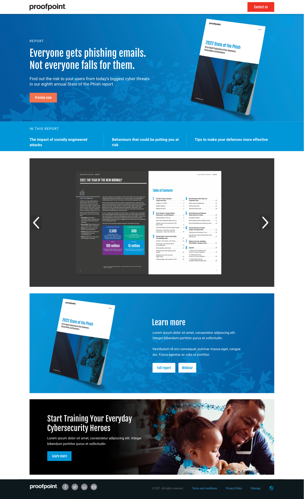

# vue-test
This is a test take home assignment for Vue.js. The assignment was to create a simple Vue.js application  following the design of the provided mockup. Time spent on the assigment was around five hours.


### The provided mockup



## Project setup
```
npm install
```

### Compiles and hot-reloads for development
```
npm run serve
```

### Compiles and minifies for production
```
npm run build
```

### Lints and fixes files
```
npm run lint
```
